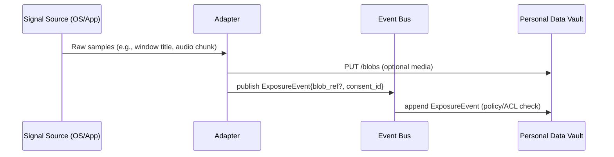
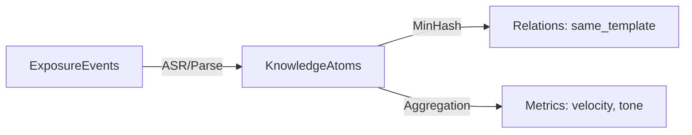

# PCF-X Developer Guide

*How to think, design, and build adapters, nodes, and clients*

## 0) TL;DR Mental Model

* **PCF-X is a contract, not a product.** You build small, capability-scoped components that exchange standard **artifacts** through a **local event bus** and store results in a **Personal Data Vault (PDV)**.
* **Everything is local-first.** Raw data stays with the user. Cloud is opt-in and encrypted.
* **Provenance is sacred.** Every output must point back to evidence (event → atom → blob).
* **Least privilege.** Your component only asks for the capabilities it truly needs.
* **Explainability.** If you flag something, show *why* with links back to artifacts.

---

## 1) Core Concepts (what you implement against)

### Artifacts (JSON contracts)

* **ExposureEvent**: “I saw/heard this.” (from Adapters)
* **KnowledgeAtom**: “Here’s a meaningful unit (claim/entity/tone) mined from an exposure.” (from Nodes)
* **Relation**: “This atom is similar/refutes/duplicates/is co-timed with that atom.” (from Nodes)
* **Metric**: “Here’s an aggregate over time (velocity, burstiness, influence).” (from Nodes)
* **ConsentManifest**: Capability grants from the user to your component.

### Plumbing

* **Event Bus**: localhost pub/sub (WebSocket or gRPC). Your component **publishes/subscribes** here.
* **PDV**: local encrypted store (append-only log + column tables + blob store + vector index). Your component **reads/writes** artifacts here via a minimal HTTP/gRPC API.
* **Capability Gate**: the PDV/bus enforces the capabilities defined in a ConsentManifest.

### Roles

* **Adapter** = sensor/ingestion. Emits **ExposureEvents**, writes blobs.
* **Node** = analysis/transform. Consumes events, emits **Atoms/Relations/Metrics**.
* **Client** = presentation. **Read-only** dashboards, reports, assistants.

---

## 2) Choosing What to Build

| Question                                                                                | If “Yes” →  |
| --------------------------------------------------------------------------------------- | ----------- |
| Do you convert raw signals (mic, captions, app focus, URLs) into standardized evidence? | **Adapter** |
| Do you enrich evidence (ASR, NER, tone, embeddings, clustering, MinHash, Hawkes)?       | **Node**    |
| Do you render insights (dashboards, alerts, PDFs) without touching raw PII?             | **Client**  |

Tip: start with **one** of the three. Keep scope tiny and composable.

---

## 3) Building an **Adapter** (Ingestion)

### Design checklist

* **Signal → ExposureEvent**: Can you turn your raw source into structured, timestamped, de-duplicated, minimal events?
* **Blobs**: Large media (audio/screenshots) go to PDV blob store; events hold a `blob_ref`.
* **Consent**: Ship a **ConsentManifest** with precise capabilities.
* **Backpressure**: Handle offline PDV/bus; queue locally; retry with jitter.
* **Redaction**: Offer pre-atomization scrubs (PII wordlist, do-not-record zones).

### Minimal flow (mermaid)



### Example: ExposureEvent

```json
{
  "schema": "pcfx.exposure_event/0.1",
  "id": "35b0a8e0-...-e0c3",
  "ts": "2025-10-20T14:32:11.123Z",
  "device": "android:pixel8",
  "adapter_id": "com.acme.android.accessibility/1.0.3",
  "capabilities_used": ["screen.focus.read","notifications.read"],
  "source": {"surface":"app","app":"com.instagram.android","frame":"main"},
  "content": {"kind":"text","text":"Buy Brand X now!", "lang":"en", "blob_ref": null},
  "privacy": {"consent_id":"consent-7f3a","pii_flags":["voice"],"retention_days":14},
  "signature": "eddsa-p256:base64..."
}
```

### ConsentManifest (ship with your adapter)

```json
{
  "schema": "pcfx.consent/0.1",
  "consent_id": "consent-7f3a",
  "subject": "user:self",
  "adapter_id": "com.acme.android.accessibility/1.0.3",
  "grants": [
    {"cap":"screen.focus.read","purpose":"exposure_audit","retention_days":30},
    {"cap":"notifications.read","purpose":"exposure_audit","retention_days":30}
  ],
  "created_at": "2025-10-20T13:55:10Z",
  "expires_at": "2026-10-20T00:00:00Z",
  "signature": "eddsa-p256:base64..."
}
```

### Do’s / Don’ts

* ✅ Do **minimize** payloads (titles/meta) and attach blobs only when necessary.
* ✅ Do **hash** content to de-dup and make idempotent writes.
* ❌ Don’t emit atoms/metrics from an adapter—keep roles clean.
* ❌ Don’t phone home; outbound net requires explicit `net.out` and user opt-in.

---

## 4) Building a **Node** (Analysis)

### Design checklist

* **Subscribe** to the smallest topics you need (e.g., `pcfx.exposures.audio`).
* **Deterministic transforms**: given input events/blobs, produce **Atoms/Relations/Metrics** that are recomputable.
* **Explainability**: each output references inputs (event ids, blob_refs).
* **Isolation**: prefer **WASM** modules; no filesystem or net unless granted.

### Typical pipeline

1. **Fetch events** → 2) **Pull blobs** (if needed) → 3) **Process** (ASR/NER/embeddings/MinHash) →
2. **Emit KnowledgeAtoms** → 5) **Emit Relations** (e.g., `same_template`) → 6) **Emit Metrics**.



### KnowledgeAtom example

```json
{
  "schema":"pcfx.knowledge_atom/0.1",
  "id":"atom-9aa1",
  "ts":"2025-10-20T14:33:05Z",
  "provenance":{
    "event_id":"35b0a8e0-...-e0c3",
    "adapter_id":"com.acme.android.accessibility/1.0.3",
    "analysis_node_id":"pcfx.atomizer/0.2.1"
  },
  "text":"Brand X increases social status.",
  "entities":[{"id":"BrandX","type":"org"}],
  "tone":{"aspiration":0.84,"authority":0.22,"fear":0.05},
  "vector_ref":"qdrant://collection:atoms/id:atom-9aa1",
  "confidence":{"extraction":0.92,"verifiability":0.41},
  "blob_refs":["sha256:audio123..."],
  "signature":"eddsa-p256:..."
}
```

### Relations & Metrics

* **Relation** types: `supports|refutes|near_duplicate|same_template|co_timed|quotes|mentions`.
* **Metric** examples: `exposure_velocity`, `burstiness`, `influence_index`.

### Implementation tips

* **MinHash** for near-duplicates; **HDBSCAN/BERTopic** for narratives;
* **Whisper-tiny** for on-device ASR; **Sentence-BERT MiniLM** for embeddings;
* Batch heavy jobs when charging/idle; persist intermediate ids for replayability.

---

## 5) Building a **Client** (Presentation)

### Design checklist

* **Read-only** access: query Atoms/Relations/Metrics, never raw blobs by default.
* **Evidence links**: every chart item should drill down to the supporting Atoms → Event → Blob (if user chooses).
* **Human language**: explain *why flagged* (“same template seen 9× in 24h; tone=aspiration 0.81”).
* **Privacy surfaces**: never embed PII by default; let the user click to reveal.

### Common views

* **Daily digest**: top actors by exposure share; new narratives; tone stack.
* **Timeline**: velocity/burstiness of selected actors/topics.
* **Template map**: repeated phrasing clusters with sources/time windows.

---

## 6) Local Dev Setup (reference)

1. **Run core**: PDV + Event Bus (reference `pcfx-core`)
2. **Register your component**: `pcfx keygen` → sign Component Manifest + SBOM
3. **Grant consent**: `pcfx consent grant com.your.adapter` → pick capabilities
4. **Develop**:

   * Adapters: publish to `POST /events` and `/blobs`
   * Nodes: subscribe to bus topics; write `/atoms`, `/relations`, `/metrics`
   * Clients: query `/atoms`, `/metrics` and subscribe to bus for live updates
5. **Test** with fixtures (see §7)

---

## 7) Testing & QA

### Fixtures

* **Golden ExposureEvents** (small corpus): app titles, sample captions, short audio.
* **Oracles**: expected Atoms (token spans/entities), Relations (same_template sets), Metrics (daily counts).

### Contract tests

* Validate JSON against **pcfx JSON Schemas**.
* Replay idempotency: re-emit same inputs and ensure outputs are stable.
* Privacy gates: ensure denied capabilities truly block calls.

### Performance

* Backpressure test: simulate PDV down; verify local queueing + recovery.
* Battery/CPU: measure duty cycle; throttle under heavy load.

---

## 8) Security & Privacy Checklist (print this)

* ☐ **Capabilities**: request only what you use; document why.
* ☐ **Consent**: ship a clear ConsentManifest; show UX to the user.
* ☐ **Immutability**: never mutate artifacts—append new versions.
* ☐ **Provenance**: every output carries source ids and (if any) blob refs.
* ☐ **TTL**: honor retention_days; purge raw blobs on schedule.
* ☐ **No silent networking**: any net access is explicit (`net.out`) and user-approved.
* ☐ **Explainability**: can a user click from insight → atom → event → evidence?
* ☐ **Logging**: redact PII in logs; logs must never leak raw content.

---

## 9) Packaging, Signatures, & Distribution

* **Component Manifest**: name, version, hash, maintainer, repo URL.
* **SBOM**: SPDX format.
* **Signature**: sign artifact and manifest with your dev key (ed25519 recommended).
* **Registration**: PDV stores manifest + key; rejects unsigned publishers (except dev mode).
* **Versioning**: follow semver; bump `major` for schema changes.

---

## 10) Minimal Example: Adapter → Node → Client (pseudo-code)

**Adapter (TypeScript, browser ext)**

```ts
// publish exposure
await fetch("http://localhost:7777/events", {
  method: "POST",
  headers: {"Content-Type":"application/json","X-PCFX-Cap":"browser.urls.read"},
  body: JSON.stringify({
    schema: "pcfx.exposure_event/0.1",
    id, ts: new Date().toISOString(),
    device: "browser:edge",
    adapter_id: "com.you.browser/0.1.0",
    capabilities_used: ["browser.urls.read"],
    source: {surface:"browser", app:"edge", url: location.href, frame:"main"},
    content: {kind:"text", text: document.title, lang: "en"},
    privacy: {consent_id, pii_flags:[], retention_days:30},
    signature
  })
});
```

**Node (Python)**

```python
# subscribe to exposures, create atoms
for ev in bus.subscribe("pcfx.exposures.browser"):
    ent = ner(ev.content["text"])
    tone = tone_model(ev.content["text"])
    vec  = embed(ev.content["text"])
    pdv.post("/atoms", {
      "schema":"pcfx.knowledge_atom/0.1",
      "id": uuid4(),
      "ts": now_iso(),
      "provenance": {"event_id": ev["id"], "adapter_id": ev["adapter_id"], "analysis_node_id": "pcfx.atomizer/0.1.0"},
      "text": ev["content"]["text"],
      "entities": ent,
      "tone": tone,
      "vector_ref": qdrant_insert(vec),
      "confidence": {"extraction": 0.9, "verifiability": 0.3},
      "blob_refs": [],
      "signature": sign(...)
    })
```

**Client (query atoms)**

```http
GET /atoms?since=2025-10-20T00:00:00Z&entity=BrandX
```

---

## 11) Designing for Upgrades & Ecosystem Fit

* **Keep schemas small.** Prefer `extra_json` / extension fields to avoid frequent breaking changes.
* **Emit more, infer less.** Future nodes can add value; don’t collapse ambiguity prematurely.
* **Document your assumptions.** Put them in the manifest for reviewers and users.
* **Play nice with others.** Publish test fixtures so other teams can validate against your outputs.

---

## 12) FAQ

**Q: Can my adapter also compute atoms to save time?**
A: Keep roles separated. If you must, split into two processes (adapter + node) to preserve provenance and capability boundaries.

**Q: How do I handle sensitive audio?**
A: Use VAD; store raw only when essential; set short `retention_days`; provide user-visible controls and auto-pause zones.

**Q: Do I need WASM?**
A: Strongly recommended for portability/sandboxing. Heavy models can live in a container if you respect capability gates.

**Q: How do I test without a full PDV?**
A: Use the mock PDV in `pcfx-core` (dev mode), replay fixtures, and assert emitted artifacts.

---

## 13) Your First Week Plan (copy/paste)

**Day 1:** Install PDV+Bus; read the JSON Schemas; run example fixtures.
**Day 2:** Emit one `ExposureEvent` from a dummy adapter.
**Day 3:** Build a tiny Node that turns events into trivial Atoms (NER on titles).
**Day 4:** Create a Metrics Node that counts exposures by app.
**Day 5:** Build a simple HTML dashboard Client (read-only).
**Day 6:** Add consent flow + capability checks; write tests.
**Day 7:** Package manifests, sign, and publish your repo with fixtures.

---

## 14) Where to Ask / Contribute (proposed)

* `pcfx-spec`: schemas, consent model, tone taxonomy
* `pcfx-core`: PDV + bus (reference)
* `pcfx-sdk-{python,ts,kotlin}`: minimal client libraries
* Weekly WG calls: ingestion / analysis / privacy / UX (once the consortium is live)

---

### Final Reminder

Build **small**, **auditable**, **explainable** components.
Let the protocol do the heavy lifting.
Your users keep their minds—**you** keep your code simple.
